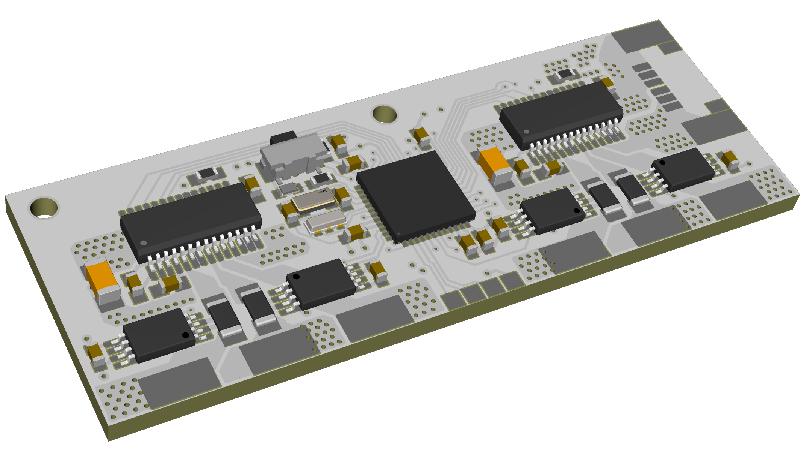
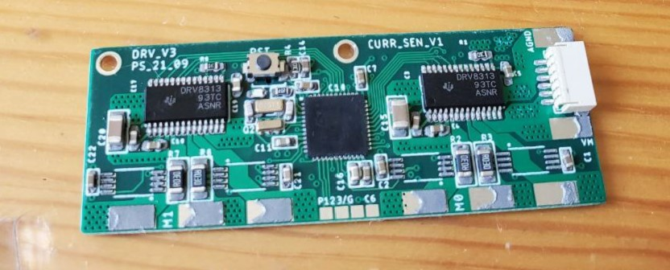
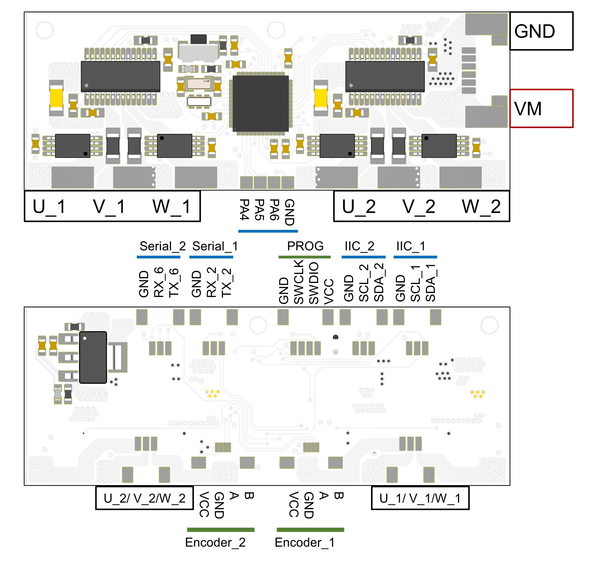

# TinyFOC_dual

   
   

* Compact dual channel brushless motor driver with external encoder
* Inline current sensing
* 15 bit GMR-based encoder
* Hardwarer I2C, serial interface
* Input voltage: 9v - 24v, maximum phase current 1.5A
* 4 layer board / FR4 / 1.0mm thickness
* [SimpleFOC](https://github.com/simplefoc) compatible

Design file exported with [Autodesk EAGLE](https://www.autodesk.com/products/eagle/overview?term=1-YEAR&tab=subscription)

## ICs
* MCU [STM32F401CCU6](https://www.st.com/en/microcontrollers-microprocessors/stm32f401cc.html)
* Motor driver [DRV8313](https://www.ti.com/product/DRV8313?utm_source=google&utm_medium=cpc&utm_campaign=asc-null-null-GPN_EN-cpc-pf-google-wwe&utm_content=DRV8313&ds_k=DRV8313&DCM=yes&gclid=EAIaIQobChMIroSGo5PH_gIV7TatBh0lfQ1tEAAYASAAEgJeRvD_BwE&gclsrc=aw.ds) or [MS8313](https://www.lcsc.com/product-detail/Others_Hangzhou-Ruimeng-Tech-MS8313_C231942.html)
* Current sensing AMP [INA240A2PWR](https://www.ti.com/product/INA240?utm_source=google&utm_medium=cpc&utm_campaign=asc-sens-null-prodfolderdynamic-cpc-pf-google-wwe_int&utm_content=prodfolddynamic&ds_k=DYNAMIC+SEARCH+ADS&DCM=yes&gclid=EAIaIQobChMI_YzZt5PH_gIVjAKtBh2dtg4yEAAYASAAEgL9CvD_BwE&gclsrc=aw.ds)
* Encoder [TLE 5012B E1000](https://www.infineon.com/cms/en/product/sensor/magnetic-sensors/magnetic-position-sensors/angle-sensors/tle5012b-e1000/)

## Pin Out
   

## License
MIT License

## Contact
* Shuang Peng, {shuangpe}@usc.edu
